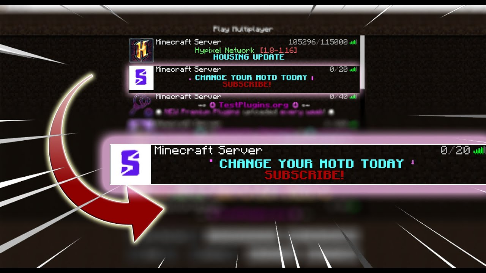

# 📜 Add an MOTD


**Difficulty Level**: 2/10


An MOTD is the text that appears under your server in the Minecraft Server list. An example of an MOTD can be seen below.

<figure><figcaption>
An MOTD is the text under a server shown in the server list
</figcaption></figure>

Adding an MOTD is pretty easy to do! All it needs is a quick modification of the `server.properties` file using text generated from MOTD creators!


MOTDs can be done in **Vanilla Minecraft** (meaning no plugins/mods/addons are necessary to utilize this in-game system for your network.




**1)** First, you'll need to make an MOTD at an MOTD creator website, that way, configuring and setting up an MOTD is 100x easier as you can customize it as you plase. We recommend utilizing [https://motd.gg/](https://motd.gg/) for it's simple and easy to use interface as well as in-game previewing.

**2)** Once you have your MOTD made (Click "Get your MOTD"), go to your server's [root directory/folder](#user-content-fn-1)[^1] and go into the `server.properties` file

**3)** Paste the text on the `motd=` line after the equal's sign, ex. `motd=Example MOTD!`

**4)** Restart your server and your MOTD should be applied!



[^1]: The Root Directory is overall parent directory of your server. This is the folder with your plugins folder, world folders, and a `server.properties` file
